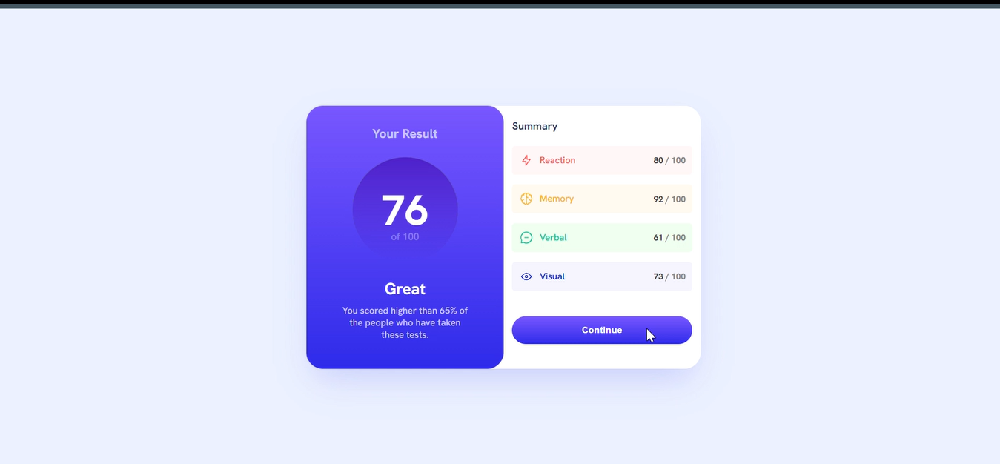
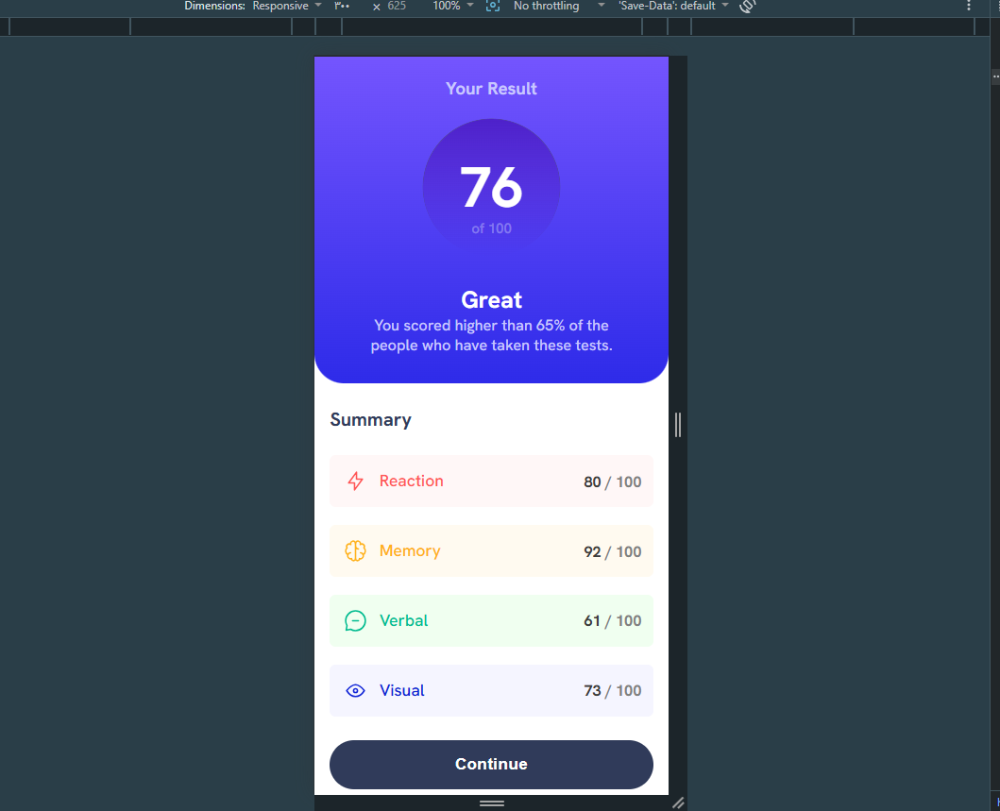

# Frontend Mentor - Result Summary Compomnent

This is a solution to the [Result Summary Compomnent](https://www.frontendmentor.io/challenges/results-summary-component-CE_K6s0maV) challenge on Frontend Mentor.

## Overview

### The challenge

Your challenge is to build out this social links profile and get it looking as close to the design as possible.

You can use any tools you like to help you complete the challenge. So if you've got something you'd like to practice, feel free to give it a go.

Your users should be able to: 

- See hover and focus states for all interactive elements on the page

### Screenshot

Desktop:

active states:

Mobile:

### Links

- Solution URL: [https://github.com/S00NY01/Result-Summary-Component-Challenge]
- Live Site URL: [https://s00ny01.github.io/Result-Summary-Component-Challenge/]

## My process

### Built with

- Semantic HTML5 markup
- CSS custom properties
- Flexbox
- Mobile-first workflow

## Author

- Frontend Mentor - [@S00NY01](https://www.frontendmentor.io/profile/S00NY01)
- GitHub - [@S00NY01](https://github.com/S00NY01)
